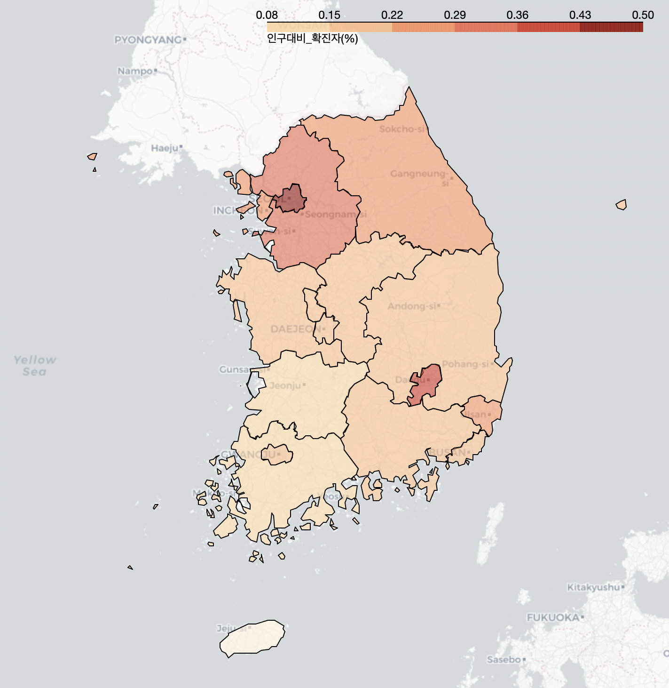
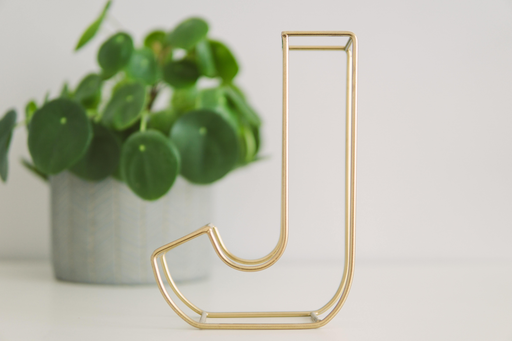
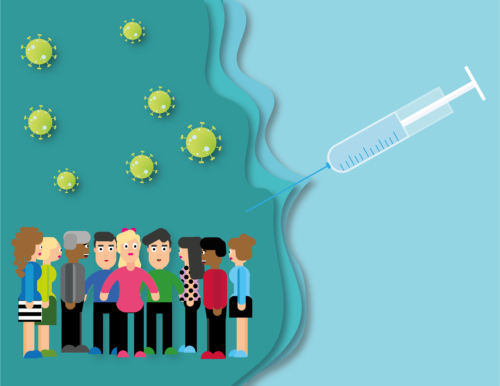

# AI School
* KICT 프로젝트반

    파이썬@ 
       <a href='https://www.facebook.com/dongjo.lim.7'>LDJ</a>
    , [임동조](frontierlim13@gmail.com)

<h2><b>데이터 사이언티스트 실무자</b></h2>

## Notice for Team Project

세미 프로젝트 진행(웹 데이터 수집 및 시각화, 데이터 분석)
* 기간 : 2022.07.13(수) ~ 2022.07.27(수)  
  * STEP 01. 팀명 정하기/팀 역할 나누기  
  * STEP 02. 데이터 수집 및 처리/시각화/기본 모델 만들기 
  * STEP 03. 모델 개선/성능 개선 및 새로운 지식 익히기 
  * STEP 04. 2022.07.26(화) 22:00 최종 결과물 제출 
  * STEP 05. 프로젝트 결과 팀발표 07.27  
  
* 팀별 최종 발표    
  * 2022.07.27(금) 09:00~13:00 (각 팀별 발표 시간 10분 내외)

## Reference Documents

# 문서초안-세부 사항은 변경될 수 있음.
- Proj-01. [포트폴리오 자료      ][proj-01]
- Proj-02. [프로젝트 결과보고서 포맷   ][proj-02]

[proj-01]:  ./docu/Goorm10_프로젝트보고서_포맷_OOO팀.docx "Go proj-01"
[proj-02]:  ./docu/팀별프로젝트수행_결과작성양식_kdigital.pptx "Go proj-02"

##  Team Project : Kick Off

- <b>1st Subject </b>: <b> 우리의 관심 분야 데이터 수집/분석해보기 </b>
- <b>Our Motto   </b>: <b> 작은 태도, 작은 땀, 작은 노력이 모여 더 나은 곳으로 인도합니다. </b>
- <b>Report Format </b>: <a href="./docu/Goorm10_프로젝트보고서_포맷_OOO팀.docx">(샘플)보고서 양식</a>
- ※ If you click on the image on the right, you can view "Initiation Report" by team.

<table border=1 bgcolor="#EEEEEE">
	<tr bgcolor="#CC0000">
		<td width="100">
		
<b>Team Name</b>

		</td>
		<td width="100">
		
<b>Team Building</b>

		</td>
		<td width="300">
		
<b>Project Subject</b>

		</td>
		<td width="120">
		
<b>Reports</b>

		</td>
	</tr>
	<tr>
		<td>
        
 팀명:------ (팀장:이정우)  
            <b></b>
		

		</td>
		<td>
            
이정우 고준희, 정주희, 최가은, 한인혁

        </td>
		<td>
			
 ---- 관련 주제 
</td>
		<td>
            
     
            

        </td>
	</tr>
	<tr>
		<td>
        
 팀명:------ (팀장:최연우)  
            <b></b>
		

		</td>
		<td>
            
최연우 김태경, 장윤서, 심연수

        </td>
		<td>
			
 ---- 관련 주제 
</td>
		<td>
            
     
            

        </td>
	</tr>
	<tr>
		<td>
        
 팀명: ---  (팀장:김찬별)  
            <b></b>
		

		</td>
		<td>
            
김찬별  박윤수, 이주행, 조기쁨, 최찬혁 

        </td>
		<td>
			
 --- 관련 주제 
</td>
		<td>
            
    
            

        </td>
	</tr>
	<tr>
		<td>
        
 팀명: ---  (팀장:박 종민)  
            <b></b>
		

		</td>
		<td>
            
박 종민  박규리, 백진선, 손희경, 윤형석 

        </td>
		<td>
			
 -- 관련 주제 
</td>
		<td>
            
     
            

        </td>
	</tr>
</table>

Goorm 인공지능 기본 과정 1기! 최고 멋진 친구들 화이팅!!!

##  Team Project : Final Report
- <b>Submission   </b>: 착수보고, 결과보고, 소스코드
- <b>Presentation </b>: 10min / team, Q&A
- <b>Keep in mind </b>: <b> Share Lessons Learned !! </b>

### Project Team A 

	<table border=1 width=100%>
		<tr>
			<td width="25%">
<b>Project Team</b>
</td>
			<td width="75%">
 --- 

			</td>
		</tr>
		<tr>
			<td>
<b>Team Members</b>
</td>
			<td>
 이정우, 고준희, 정주희, 최가은, 한인혁 
</td>
		</tr>
		<tr>
			<td>
<b>Report</b>
</td>
			<td>
				
 
					<a href="https://ldjwj.github.io/Goorm_1st_DataCourse/01_TeamProject_First_DataStart/last_reports/team_A_BuildUp_last.pdf">[A팀 결과보고]</a> &nbsp;&nbsp;&nbsp; 
				

			</td>
		</tr>
		<tr>
			<td>
<b>Subject</b>
</td>
			<td>
 인-- 주제 재료 
</td>
		</tr>
		<tr>
			<td>
<b>Presentation</b>
</td>
			<td>
				

				
				

			</td>
		</tr>
	</table>

 

### Project Team B 

<table border=1 width=100%>
	<tr>
		<td width="25%">
<b>팀명</b>
</td>
		<td width="75%">
 최연우 
</td>
	</tr>
	<tr>
		<td>
<b>Team Members</b>
</td>
		<td>
 김태경, 심연수, 장윤서 
</td>
	</tr>
	<tr>
		<td>
<b>Report</b>
</td>
		<td>
			
 
				<a href="https://ldjwj.github.io/Goorm_1st_DataCourse/01_TeamProject_First_DataStart/last_reports/team_B_AllReady_last.pdf">[B팀 결과보고]</a> &nbsp;&nbsp;&nbsp; 
			

		</td>
	</tr>
	<tr>
		<td>
<b>Subject</b>
</td>
		<td>
 --- 주제 
</td>
	</tr>
	<tr>
		<td>
<b>Presentation</b>
</td>
		<td>
			

				
			

		</td>
	</tr>
</table>

 

### Project Team C 

<table border=1 width=100%>
	<tr>
		<td width="25%">
<b>Project Team</b>
</td>
		<td width="75%">
 팀명 
</td>
	</tr>
	<tr>
		<td>
<b>Team Members</b>
</td>
		<td>
 김찬별, 박윤수, 이주행, 조기쁨, 최찬혁 
</td>
	</tr>
	<tr>
		<td>
<b>Report</b>
</td>
		<td>
			
 
				<a href="./last_reports/team_C_last.pdf">[C팀 결과보고]</a> &nbsp;&nbsp;&nbsp; 
			

		</td>
	</tr>
	<tr>
		<td>
<b>Subject</b>
</td>
		<td>
 주제 아카이브 
</td>
	</tr>
	<tr>
		<td>
<b>Presentation</b>
</td>
		<td>
			

				
			

		</td>
	</tr>
</table>

 

### Project Team D 

<table border=1 width=100%>
	<tr>
		<td width="25%">
<b>Project Team</b>
</td>
		<td width="75%">
 팀명 
</td>
	</tr>
	<tr>
		<td>
<b>Team Members</b>
</td>
		<td>
 박종민, 박규리, 백진선, 손희경, 윤형석 
</td>
	</tr>
	<tr>
		<td>
<b>Report</b>
</td>
		<td>
			
 
				<a href="https://ldjwj.github.io/Goorm_1st_DataCourse/01_TeamProject_First_DataStart/last_reports/team_D_last.pdf">[D팀 결과보고]</a> &nbsp;&nbsp;&nbsp; 
			

		</td>		
	</tr>
	<tr>
		<td>
<b>Subject</b>
</td>
		<td>
 주제 내용 
</td>
	</tr>
	<tr>
		<td>
<b>Presentation</b>
</td>
		<td>
			

				
			

		</td>
	</tr>
</table>

 

 &lt; The End &gt; 

