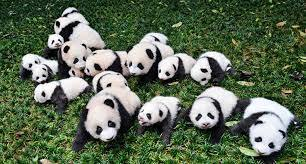

# AI School
* KICT 프로젝트반

    파이썬@ 
       <a href='https://www.facebook.com/dongjo.lim.7'>LDJ</a>
    , [임동조](frontierlim13@gmail.com)

<h2><b>파일럿 데이터 분석</b></h2>

## Notice for Team Project

세미 프로젝트 진행(데이터 선택, 데이터 EDA, 기본 모델 만들어보기)
* 기간 : 2022.08.08(월) ~ 2022.08.12(금)  

## Reference Documents

# 문서초안-세부 사항은 변경될 수 있음.
- Proj-01. [포트폴리오 자료      ][proj-01]
- Proj-02. [프로젝트 결과보고서 포맷   ][proj-02]

[proj-01]:  ./docu/Goorm10_프로젝트보고서_포맷_OOO팀.docx "Go proj-01"
[proj-02]:  ./docu/팀별프로젝트수행_결과작성양식_kdigital.pptx "Go proj-02"

<table border=1 bgcolor="#EEEEEE">
	<tr bgcolor="#CC0000">
		<td width="100">
		
<b>Team Name</b>

		</td>
		<td width="100">
		
<b>Team Building</b>

		</td>
		<td width="300">
		
<b>Project Subject</b>

		</td>
		<td width="120">
		
<b>Reports</b>

		</td>
	</tr>
	<tr>
		<td>
        
 팀명: 자비스  (팀장:이정우)  
            <b></b>
		

		</td>
		<td>
            
이정우 고준희, 정주희, 최가은

        </td>
		<td>
			
 Kaggle Competition - Paddy Doctor 
</td>
		<td>
            
     
            

        </td>
	</tr>
	<tr>
		<td>
        
 팀명:판다스 (팀장:최연우)  
            <b></b>
		

		</td>
		<td>
            
최연우 심연수(부팀장), 김태경, 장윤서

        </td>
		<td>
			
 Kaggle Competition - Paddy Doctor 
</td>
		<td>
            
 
			    
            

        </td>
	</tr>
	<tr>
		<td>
        
 팀명: AI_C  (팀장:김찬별)  
            <b></b>
		

		</td>
		<td>
            
김찬별  박윤수(부팀장), 이주행, 조기쁨, 최찬혁 

        </td>
		<td>
			
 Kaggle Competition - Paddy Doctor 
</td>
		<td>
            
    
            

        </td>
	</tr>
	<tr>
		<td>
        
 팀명: 구름다리  (팀장:박 종민)  
            <b></b>
		

		</td>
		<td>
            
박 종민  손희경(부팀장), 박규리, 백진선, 윤형석 

        </td>
		<td>
			
 Kaggle Competition - Paddy Doctor 
</td>
		<td>
            
     
            

        </td>
	</tr>
</table>

 

 &lt; The End &gt; 

